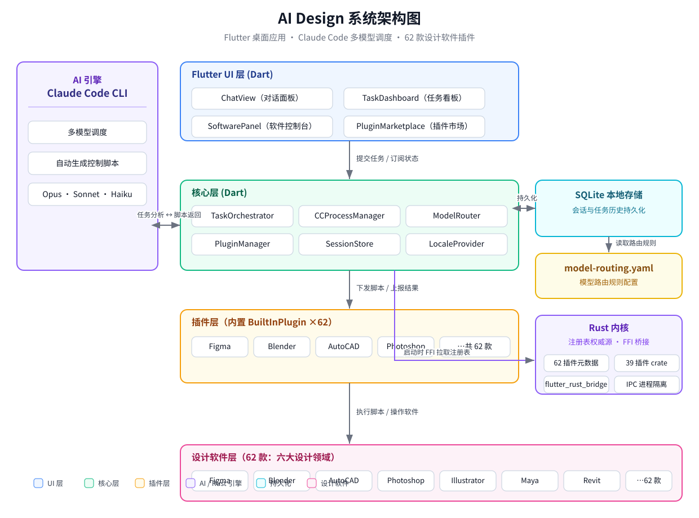
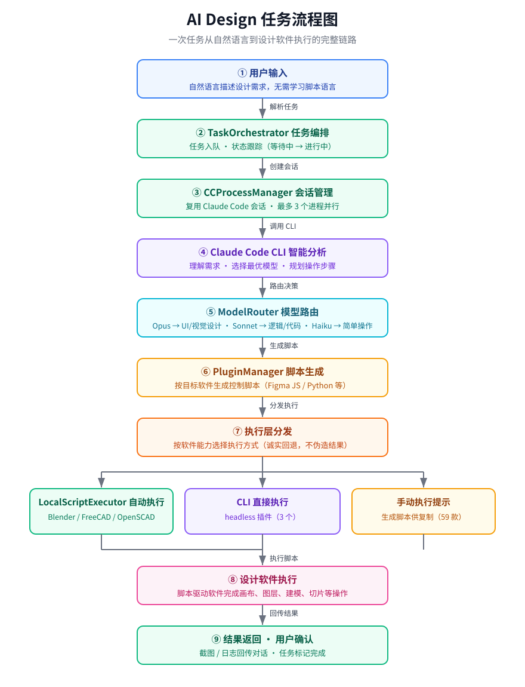
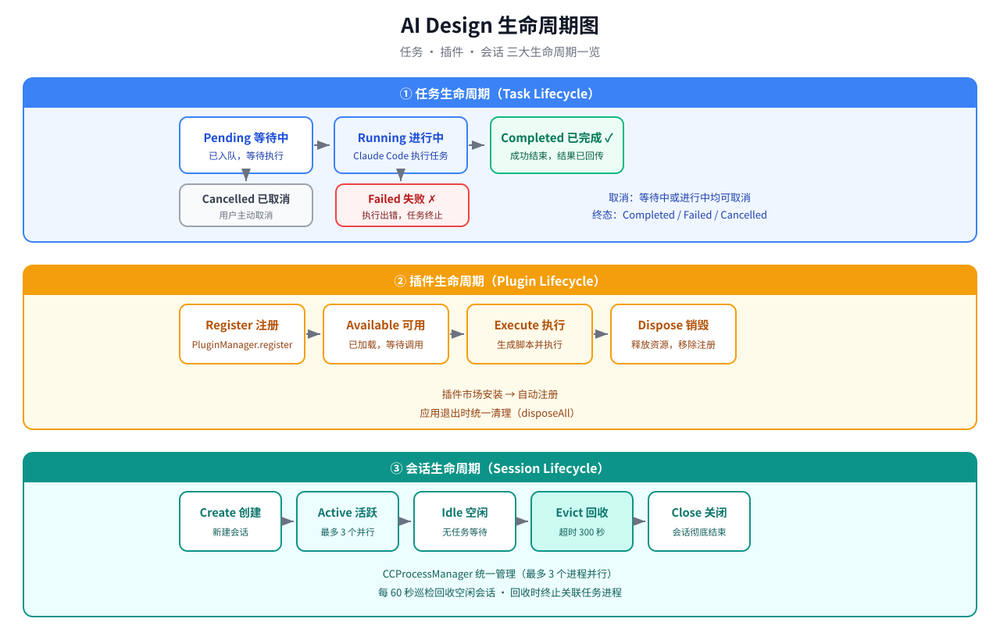
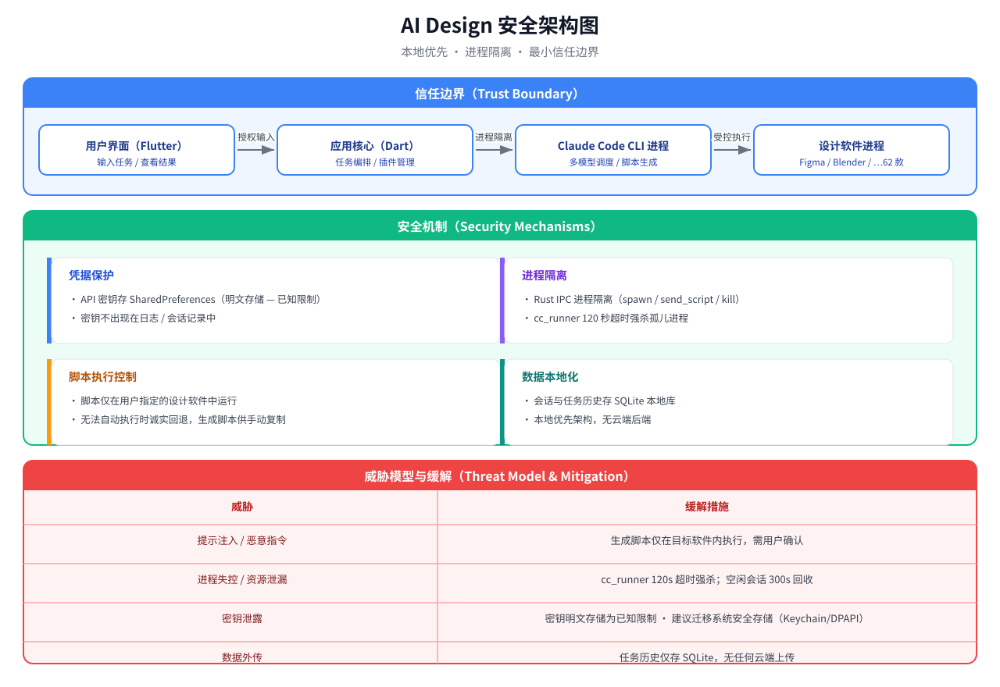
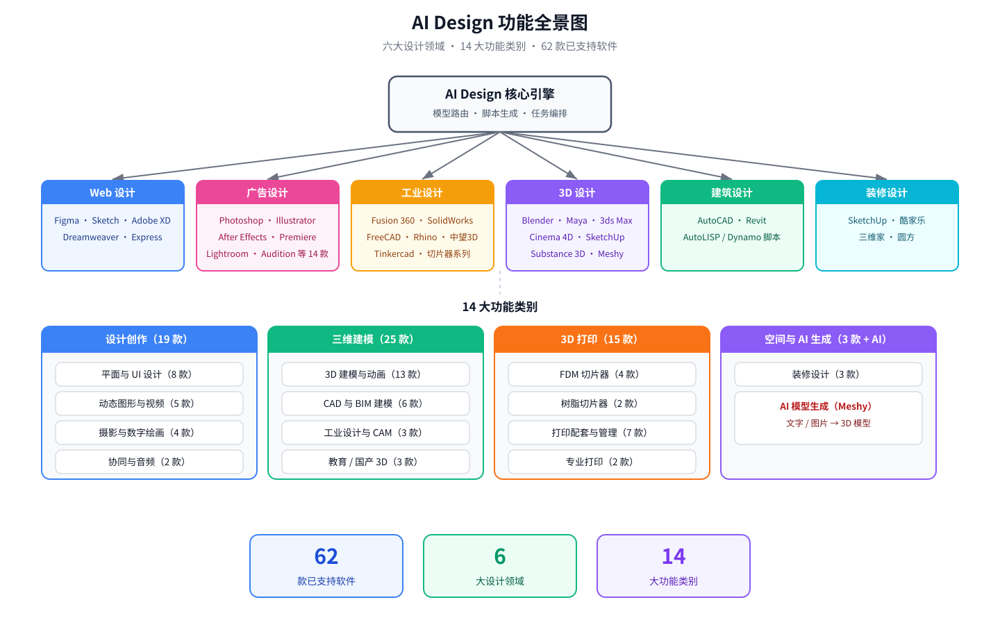

# AI Design

> 跨平台 AI 驱动设计工具 — 封装 Claude Code，调用多模型智能控制各类设计软件

[English](README_EN.md)

## 项目简介

AI Design是一个支持 **Windows** 和 **macOS** 的桌面应用，通过内置 Claude Code CLI 实现 AI 驱动的多模型调度，自动生成控制脚本并操作各类设计软件。覆盖 **六大设计领域**：Web 设计、广告设计、工业设计、3D 设计、建筑设计、装修设计。

### 核心理念

设计师不需要学习每种软件的脚本语言。用自然语言描述需求，AI 自动生成并执行控制脚本，直接操作设计软件完成重复性工作。

```
用户: "把画布上所有蓝色矩形改成红色"
  ↓
Claude Code 分析任务 → 选择最优模型 → 生成 Figma JavaScript 脚本
  ↓
执行层 (LocalScriptExecutor / CLI) → 设计软件执行 → 返回结果
  （无 CLI 的软件：生成脚本并提示手动执行）
```

## 架构设计

### 系统架构



### 技术栈

| 层 | 技术 | 用途 |
|---|------|------|
| UI | Flutter 3.x + Material 3 | 跨平台桌面界面 |
| 核心逻辑 | Dart | 任务编排、模型路由、会话管理 |
| 插件 | Dart (内置) | 设计软件脚本生成、插件管理、市场分发 |
| 配置 | YAML | 模型路由规则配置 |
| AI 引擎 | Claude Code CLI | 多模型调度与脚本生成 |
| 持久化 | SQLite (sqflite) | 会话与任务历史 |

### 任务流程图



### 插件架构

每个设计软件作为内置 `BuiltInPlugin` 实例，实现统一的 `DesignPlugin` 接口。脚本生成后由执行层分发：

```
Dart (接口定义)  →  PluginManager  →  BuiltInPlugin (脚本生成)
                                                    |
                          +-------------------------+--------------------------+
                          v                         v                          v
                 LocalScriptExecutor          CLI 直接执行               手动执行提示
                 (Blender/FreeCAD/           (3 个 headless 插件)        (无 CLI 的软件：
                  OpenSCAD 脚本执行)                                      生成脚本供复制)
```

- CLI 直接执行（Blender、FreeCAD、OpenSCAD）：`LocalScriptExecutor` 自动检测可执行文件并直接运行脚本，软件面板显示 Auto 徽标与实时连接状态。
- 手动执行（Figma、Photoshop、切片器等 59 个）：诚实回退 —— 生成脚本并提示在软件中手动执行，软件面板显示 Manual 徽标。切片器 CLI 只接受模型文件而非脚本，故不列入自动执行。

### 模型路由

| 任务类型 | 模型 | 示例 |
|---------|------|------|
| UI/视觉设计 | Claude Opus | Figma 布局、配色方案 |
| 逻辑/代码生成 | Claude Sonnet | HTML/CSS、插件脚本 |
| 3D/空间推理 | 视觉模型 | Blender 建模、CAD 参数化 |
| 简单操作 | Claude Haiku | 批量重命名、导出设置 |
| 创意构思 | 创意模型 | 广告方案、风格建议 |

路由规则通过 `config/model-routing.yaml` 配置（含复杂度推断关键词 `keywords` 段），支持接入任何兼容 OpenAI API 格式的模型。

### 生命周期

任务、插件、会话三大生命周期一览。会话空闲超过 300 秒即被每 60 秒一次的巡检自动回收，回收时同步终止关联的 Claude 进程，避免进程泄漏：



### 安全架构

本地优先 · 进程隔离 · 最小信任边界：



已知限制：API 密钥明文存储于本地 SharedPreferences（未加密），建议后续迁移至系统安全存储（macOS Keychain / Windows DPAPI）。

## 项目结构

```
ai-desgin/
+-- lib/
|   +-- main.dart                          # 应用入口
|   +-- app.dart                           # MaterialApp + 路由
|   +-- models/                            # 数据模型
|   |   +-- session.dart                   # Session, DesignCategory
|   |   +-- task_record.dart               # TaskRecord, TaskStatus
|   |   +-- plugin.dart                    # PluginMeta, ScriptResult
|   |   +-- software_capabilities.dart     # SoftwareCapabilities
|   +-- plugin_sdk/
|   |   +-- design_plugin.dart             # DesignPlugin 抽象接口
|   +-- core/
|   |   +-- plugin_manager.dart            # 插件注册/生命周期
|   |   +-- model_router.dart              # 模型路由引擎
|   |   +-- cc_process_manager.dart        # Claude Code 会话管理
|   |   +-- cc_runner.dart                 # Claude Code 子进程通信
|   |   +-- local_script_executor.dart     # 本地 CLI 脚本执行层
|   |   +-- task_orchestrator.dart         # 任务编排引擎
|   |   +-- session_store.dart             # SQLite 会话持久化
|   |   +-- locale_provider.dart           # 12 语言切换与持久化
|   |   +-- builtin_plugins.dart             # 内置插件注册表（单一数据源）
|   +-- ui/
|       +-- shell.dart                     # 侧边栏 + 页面布局
|       +-- chat_view.dart                 # AI 对话面板
|       +-- task_dashboard.dart            # 任务队列/历史
|       +-- software_panel.dart            # 软件连接/状态
|       +-- settings_view.dart             # 系统设置
|       +-- plugin_marketplace.dart        # 插件市场
+-- rust/
|   +-- Cargo.toml                         # Rust workspace 根
|   +-- core/
|   |   +-- src/
|   |       +-- traits.rs                  # DesignPlugin Rust trait
|   |       +-- types.rs                   # 共享类型定义
|   |       +-- registry.rs                # 插件注册表（62 条，运行时权威源）
|   |       +-- api.rs                     # FFI 边界层（String 入出参，供 flutter_rust_bridge 绑定）
|   |       +-- ipc.rs                     # 进程隔离工具
|   +-- plugins/
|       +-- figma/                         # Figma (REST API)
|       +-- photoshop/                     # Photoshop (ExtendScript)
|       +-- illustrator/                   # Illustrator (ExtendScript)
|       +-- indesign/                      # InDesign (ExtendScript)
|       +-- aftereffects/                  # After Effects (ExtendScript) [📋 Dart桩]
|       +-- premierepro/                   # Premiere Pro (ExtendScript) [📋 Dart桩]
|       +-- xd/                            # Adobe XD (ExtendScript) [📋 Dart桩]
|       +-- lightroom/                     # Lightroom (Lua) [📋 Dart桩]
|       +-- animate/                       # Animate (JSFL) [📋 Dart桩]
|       +-- audition/                      # Audition (ExtendScript) [📋 Dart桩]
|       +-- dreamweaver/                   # Dreamweaver (ExtendScript) [📋 Dart桩]
|       +-- characteranimator/             # Character Animator (ExtendScript) [📋 Dart桩]
|       +-- fresco/                        # Fresco (JS) [📋 Dart桩]
|       +-- dimension/                     # Dimension (ExtendScript) [📋 Dart桩]
|       +-- bridge/                        # Bridge (ExtendScript) [📋 Dart桩]
|       +-- acrobat/                       # Acrobat Pro (JS) [📋 Dart桩]
|       +-- substancepainter/              # Substance 3D Painter (Python) [📋 Dart桩]
|       +-- substancedesigner/             # Substance 3D Designer (Python) [📋 Dart桩]
|       +-- substancesampler/              # Substance 3D Sampler (Python) [📋 Dart桩]
|       +-- substancestager/               # Substance 3D Stager (Python) [📋 Dart桩]
|       +-- substancemodeler/              # Substance 3D Modeler (Python) [📋 Dart桩]
|       +-- mediaencoder/                  # Media Encoder (ExtendScript) [📋 Dart桩]
|       +-- incopy/                        # InCopy (ExtendScript) [📋 Dart桩]
|       +-- express/                       # Adobe Express (REST) [📋 Dart桩]
|       +-- sketch/                        # Sketch (sketchtool/JS)
|       +-- blender/                       # Blender (Python)
|       +-- maya/                          # Maya (Python)
|       +-- 3dsmax/                        # 3ds Max (MaxScript/Python)
|       +-- cinema4d/                      # Cinema 4D (Python)
|       +-- fusion360/                     # Fusion 360 (Python)
|       +-- solidworks/                    # SolidWorks (VBA/COM)
|       +-- freecad/                       # FreeCAD (Python)
|       +-- openscad/                      # OpenSCAD (SCAD)
|       +-- rhino/                         # Rhino (Python)
|       +-- zw3d/                          # 中望3D (Python)
|       +-- autocad/                       # AutoCAD (AutoLISP)
|       +-- revit/                         # Revit (Dynamo/.NET)
|       +-- sketchup/                      # SketchUp (Ruby)
|       +-- tinkercad/                     # Tinkercad (REST)
|       +-- meshy/                         # Meshy (AI REST)
|       +-- 3done/                         # 3D One (Python)
|       +-- voxeldance/                    # VoxelDance Additive
|       +-- happy3d/                       # Happy3D (Python)
|       +-- maodou3d/                      # 毛豆科技3D建模 (Python)
|       +-- cura/                          # Cura (CLI，仅模型文件 — 脚本手动执行)
|       +-- prusaslicer/                   # PrusaSlicer (CLI，仅模型文件 — 脚本手动执行)
|       +-- orcaslicer/                    # OrcaSlicer (CLI，仅模型文件 — 脚本手动执行)
|       +-- simplify3d/                    # Simplify3D (CLI，仅模型文件 — 脚本手动执行)
|       +-- chitubox/                      # ChiTuBox (CLI，仅模型文件 — 脚本手动执行)
|       +-- lychee/                        # Lychee (CLI，仅模型文件 — 脚本手动执行)
|       +-- makerlab/                      # MakerLab (Python)
|       +-- crealitycloud/                 # Creality Cloud (Python)
|       +-- flashprint/                    # FlashPrint (Python)
|       +-- flashstudio/                   # Flash Studio (Python)
|       +-- snapmakerluban/                # Snapmaker Luban (Python)
|       +-- snapmakerorca/                 # Snapmaker Orca (Python)
|       +-- buildplanner/                  # Build Planner (Python)
|       +-- flashdental/                   # FlashDental (Python)
|       +-- waxjetprint/                   # WaxJetPrint (Python)
+-- config/
|   +-- model-routing.yaml                 # 模型路由配置
+-- scripts/
|   +-- build.sh                           # Unix 构建
|   +-- build_windows.bat                  # Windows 构建
|   +-- release.sh                         # 发布打包
+-- test/                                  # Dart 测试 (107 tests)
+-- docs/
    +-- diagrams/                          # 中英文 SVG 图表（架构/流程/功能/生命周期/安全）
    |   +-- architecture-zh.svg            # 系统架构图
    |   +-- architecture-en.svg            # System architecture
    |   +-- task-flow-zh.svg               # 任务流程图
    |   +-- task-flow-en.svg               # Task flow
    |   +-- features-zh.svg                # 功能全景图
    |   +-- features-en.svg                # Feature map
    |   +-- lifecycle-zh.svg               # 生命周期图
    |   +-- lifecycle-en.svg               # Lifecycle diagram
    |   +-- security-zh.svg                # 安全架构图
    |   +-- security-en.svg                # Security architecture
    +-- test-report-2026-07-31.md          # 测试报告
    +-- review-report-2026-08-07-v26.md    # 最新审查报告（v14-v25 历轮报告同目录）
    +-- superpowers/
        +-- specs/                         # 设计规格文档
        +-- plans/                         # 实现计划文档
```

## 快速开始

### 环境要求

- **Flutter SDK** >= 3.x（含 Windows/macOS 平台支持）
- **Rust** >= 1.75（Cargo + rustup）
- **Claude Code CLI**（可选，用于 AI 脚本生成功能）
- 至少一款设计软件：Figma / Blender / AutoCAD / Photoshop

### 安装与构建

```bash
# 克隆项目
git clone <repo-url> ai-desgin
cd ai-desgin

# 安装 Flutter 依赖
flutter pub get

# 编译 Rust 插件
cd rust && cargo build --release && cd ..

# 一键构建（自动编译 Rust FFI 内核并拷入 bundle）
bash scripts/build.sh        # macOS / Linux
scripts\build_windows.bat     # Windows

# 开发模式
flutter run -d windows        # 或 -d macos / -d linux
```

### 安装发行版

从 [Releases](https://github.com/erikwang2013/ai-desgin/releases) 下载对应平台的
安装包，**无需安装 Flutter / Rust 环境**。

**运行环境要求**

- Windows 10 / 11（64 位）
- macOS 11+（Intel / Apple Silicon）
- Linux x86_64，需 GTK3 运行库（Ubuntu 20.04+ / Debian 11+ / Fedora 38+ 等）
- 内存 ≥ 4GB，磁盘 ≥ 300MB
- 至少一款目标设计软件（Figma / Blender / Photoshop 等）

**Linux**

| 格式 | 安装方式 |
|------|----------|
| `.deb` | `sudo apt install ./AI-Design-Studio-Linux-<版本>.deb` |
| `.rpm` | `sudo dnf install AI-Design-Studio-Linux-<版本>.rpm`（或 `sudo rpm -i`） |
| `.AppImage` | `chmod +x AI-Design-Studio-Linux-<版本>.AppImage && ./AI-Design-Studio-Linux-<版本>.AppImage` |
| `.tar.gz` / `.tar.xz` | 解压后运行 `AI-Design-Studio/ai_design_studio` |

**Windows**：解压 `.zip`，运行 `AI-Design-Studio\ai_design_studio.exe`。

**macOS**：解压 `.zip`，将 `ai_design_studio.app` 拖入「应用程序」。
首次打开若被 Gatekeeper 拦截：右键 → 打开 → 打开。

### Rust 内核集成

App 启动时通过 flutter_rust_bridge 加载 Rust 内核（`libai_design_core.so` / `.dll` / `.dylib`），
插件注册表以 **Rust 为运行时权威源**（62 条元数据 + 能力）。动态库缺失或加载失败时
自动回退到 Dart 内置常量（`builtin_plugins.dart`），App 功能不受影响；
软件面板底部状态行显示「Rust 内核已连接 / 未连接（Dart 回退）」。

重新生成绑定（修改 `rust/core/src/api.rs` 后）：

```bash
flutter_rust_bridge_codegen generate
```

### 持续集成（GitHub Actions）

`.github/workflows/build.yml`：push 到 `main` 或打 `v*` tag（也可手动触发）后，
在 ubuntu / windows / macos 三端 runner 上并行构建 Rust core + Flutter 应用并自动打包：

| 平台 | 产物 |
|------|------|
| Linux | `AI-Design-Studio-Linux-<版本>.tar.gz` / `.tar.xz` / `.deb` / `.rpm` / `.AppImage`（均含 `libai_design_core.so`） |
| Windows | `AI-Design-Studio-Windows-<版本>.zip`（含 `ai_design_core.dll`） |
| macOS | `AI-Design-Studio-macOS-<版本>.zip`（.app 内嵌 `libai_design_core.dylib` + ad-hoc 签名） |

产物在 Actions 页面 Artifacts 中下载。Flutter 固定 3.44.2（匹配本机 Dart 3.12.2）。
注意：Windows / macOS 首轮构建可能暴露 Linux 未验证过的平台差异（39 个插件 crate），
三个 job 相互独立（`fail-fast: false`），任一失败不影响其余平台。

### 运行测试

```bash
flutter test                  # 全部 Dart 测试
cd rust && cargo build        # Rust 编译验证 (40 crates)
cd rust && cargo clippy       # Rust lint 检查
```

### 代码质量

| 检查项 | 状态 |
|--------|------|
| `flutter analyze` | No issues found |
| `flutter test` | 107 tests passed |
| `cargo check` | 40 crates compiled |
| `cargo clippy` | 0 warnings |

详细报告：[审查报告 v26](docs/review-report-2026-08-07-v26.md) | [审查报告 v25](docs/review-report-2026-08-07-v25.md) | [审查报告 v24](docs/review-report-2026-08-07-v24.md)

## 使用教程

### 第一步：连接软件

打开应用，在左侧「软件控制台」查看已安装的插件。状态灯显示连接情况：绿色已连接、灰色未连接。确保目标设计软件已启动。

### 第二步：选择领域

左侧边栏切换设计领域，AI 会根据领域自动选择合适的模型和控制策略：
- **Web 设计** -> Figma、Sketch、Adobe XD、Dreamweaver、Express
- **广告设计** -> Photoshop、Illustrator、InDesign、After Effects、Premiere Pro、Lightroom、Animate、Audition、Character Animator、Fresco、Bridge、Acrobat Pro、Media Encoder、InCopy
- **工业设计** -> Fusion 360、SolidWorks、FreeCAD、OpenSCAD、Rhino、Tinkercad、中望3D、切片器系列
- **3D 设计** -> Blender、Maya、3ds Max、Cinema 4D、3D One、Happy3D、毛豆科技、Meshy、Dimension、Substance 3D 系列
- **建筑设计** -> AutoCAD、Revit
- **装修设计** -> SketchUp、酷家乐、三维家、圆方

### 第三步：描述需求

在对话面板用自然语言描述设计操作：

> 「在 Figma 中创建 1440x900 的登录页面，居中白色卡片，包含邮箱输入框、密码框和蓝色登录按钮」

> 「在 Blender 中创建一个房间场景，添加地板材质和点光源」

> 「把当前 Photoshop 文档中所有文字图层的字体改为思源黑体」

> 「在 After Effects 中创建一个 Logo 出场动画，2 秒缩放淡入，缓动曲线」

> 「在 Substance 3D Painter 中为这个模型创建锈蚀金属材质，导出 4K PBR 贴图」

### 第四步：预览执行

AI 生成脚本后会展示预览，确认无误后点击执行。执行结果实时显示在对话框中。

### 第五步：管理任务

在「任务看板」追踪所有任务状态：等待中 / 进行中 / 已完成 / 失败。可按状态筛选，查看历史记录。

### 配置模型

在「设置 -> 模型配置」中配置 API endpoint 和密钥。模型路由规则在 `config/model-routing.yaml` 中自定义。

### 安装新插件

「设置 -> 插件市场」中浏览可用插件，一键安装。安装后即可在软件控制台中看到新的软件入口。

## 功能说明



### 平面与 UI 设计

支持 Figma、Sketch、Photoshop、Illustrator、InDesign、Adobe XD 和 Dreamweaver 的自动化操作。AI 可以创建画布、添加图层、设置样式、导出切图，将设计稿直接转为 HTML/CSS 代码。

### 动态图形与视频

支持 After Effects、Premiere Pro、Animate、Character Animator、Audition 和 Media Encoder 的自动化操作。AI 可以创建合成、设置关键帧动画、应用特效、剪辑视频、混音，以及批量渲染输出。

### 数字绘画与摄影

支持 Lightroom、Fresco、Bridge 和 Acrobat Pro 的自动化操作。AI 可以批量调色、应用预设、管理素材、处理 PDF 文档，以及照片色彩校正。

### 3D 建模与动画

覆盖主流参数化建模、多边形建模和 NURBS 曲面建模软件。支持 Maya、3ds Max、Cinema 4D 的骨骼绑定、动画制作和渲染。新增 Substance 3D 全系列（Painter、Designer、Sampler、Stager、Modeler）和 Dimension，覆盖 PBR 材质创作、3D 纹理绘制、VR 建模和产品渲染。AI 可自动创建零件、装配体、生成工程图、导出 STL/STEP 等格式用于 3D 打印。

### 3D 打印切片与配套

完整支持 FDM 和树脂打印流程，覆盖主流切片器和打印管理平台。AI 可根据模型复杂度自动设置层高、填充密度、支撑结构，一键生成 GCode 或 CTB 切片文件。支持 Snapmaker 多功能 CAM、Creality Cloud 云端打印、FlashDental 牙科打印等专业场景。

### AI 模型生成

通过 Meshy API 实现文字/图片到 3D 模型的 AI 生成，自动优化面数、生成纹理、导出多格式。

## 已支持的软件

### 平面与 UI 设计（8 个）

| 软件 | 控制方式 | 平台 | 状态 |
|------|---------|------|------|
| Figma | REST API + 浏览器自动化 | Web/macOS/Win | 已支持 |
| Photoshop | ExtendScript + COM/AppleScript | macOS/Win | 已支持 |
| Sketch | sketchtool CLI + osascript | macOS | 已支持 |
| Illustrator | ExtendScript | macOS/Win | 已支持 |
| InDesign | ExtendScript | macOS/Win | 已支持 |
| Adobe XD | ExtendScript + 插件API | macOS/Win | 已支持 |
| Dreamweaver | ExtendScript | macOS/Win | 已支持 |
| Adobe Express | REST API | Web | 已支持 |

### 动态图形与视频编辑（5 个）

| 软件 | 控制方式 | 平台 | 状态 |
|------|---------|------|------|
| After Effects | ExtendScript | macOS/Win | 已支持 |
| Premiere Pro | ExtendScript | macOS/Win | 已支持 |
| Animate | ExtendScript + JSFL | macOS/Win | 已支持 |
| Character Animator | ExtendScript | macOS/Win | 已支持 |
| Media Encoder | ExtendScript + CLI | macOS/Win | 已支持 |

### 摄影与数字绘画（4 个）

| 软件 | 控制方式 | 平台 | 状态 |
|------|---------|------|------|
| Lightroom | Lua SDK | macOS/Win/iOS | 已支持 |
| Fresco | JavaScript API | Win/iOS | 已支持 |
| Bridge | ExtendScript | macOS/Win | 已支持 |
| Acrobat Pro | JavaScript API | macOS/Win | 已支持 |

### 协同与音频（2 个）

| 软件 | 控制方式 | 平台 | 状态 |
|------|---------|------|------|
| Audition | ExtendScript | macOS/Win | 已支持 |
| InCopy | ExtendScript | macOS/Win | 已支持 |

### 3D 动画与建模（13 个）

| 软件 | 控制方式 | 平台 | 状态 |
|------|---------|------|------|
| Blender | Python bpy | macOS/Win/Linux | 已支持 |
| Maya | Python API | macOS/Win/Linux | 已支持 |
| 3ds Max | MaxScript / Python | Win | 已支持 |
| Cinema 4D | Python API | macOS/Win | 已支持 |
| SketchUp | Ruby API | macOS/Win | 已支持 |
| Rhino | Python/RhinoScript | macOS/Win | 已支持 |
| Meshy | REST API（AI 生成） | Web | 已支持 |
| Dimension | ExtendScript | macOS/Win | 已支持 |
| Substance 3D Painter | Python API | macOS/Win/Linux | 已支持 |
| Substance 3D Designer | Python API | macOS/Win/Linux | 已支持 |
| Substance 3D Sampler | Python API | macOS/Win | 已支持 |
| Substance 3D Stager | Python API | macOS/Win | 已支持 |
| Substance 3D Modeler | Python API | Win | 已支持 |

### CAD 与 BIM 建模（6 个）

| 软件 | 控制方式 | 平台 | 状态 |
|------|---------|------|------|
| Fusion 360 | Python API | macOS/Win | 已支持 |
| SolidWorks | VBA/COM | Win | 已支持 |
| FreeCAD | Python API | macOS/Win/Linux | 已支持 |
| OpenSCAD | SCAD 脚本 | macOS/Win/Linux | 已支持 |
| AutoCAD | AutoLISP | macOS/Win | 已支持 |
| Revit | Dynamo / .NET API | Win | 已支持 |

### 工业设计与 CAM（3 个）

| 软件 | 控制方式 | 平台 | 状态 |
|------|---------|------|------|
| 中望3D | Python API | Win | 已支持 |
| VoxelDance Additive | Python API | Win | 已支持 |
| Tinkercad | REST API | Web | 已支持 |

### 教育 / 国产 3D 软件（3 个）

| 软件 | 控制方式 | 平台 | 状态 |
|------|---------|------|------|
| 3D One 系列 | Python API | Win | 已支持 |
| Happy3D | Python API | Win | 已支持 |
| 毛豆科技 3D 建模 | Python API | Win | 已支持 |

### FDM 切片器（4 个）

| 软件 | 控制方式 | 平台 | 状态 |
|------|---------|------|------|
| UltiMaker Cura | CuraEngine CLI | macOS/Win/Linux | 已支持 |
| PrusaSlicer | CLI | macOS/Win/Linux | 已支持 |
| OrcaSlicer | CLI | macOS/Win/Linux | 已支持 |
| Simplify3D | CLI | macOS/Win | 已支持 |

### 树脂切片器（2 个）

| 软件 | 控制方式 | 平台 | 状态 |
|------|---------|------|------|
| ChiTuBox | CLI | macOS/Win | 已支持 |
| Lychee Slicer | CLI | macOS/Win/Linux | 已支持 |

### 3D 打印配套与管理（7 个）

| 软件 | 控制方式 | 平台 | 状态 |
|------|---------|------|------|
| MakerLab | Python API | Web | 已支持 |
| Creality Cloud | Python API | Web | 已支持 |
| FlashPrint | Python API | macOS/Win | 已支持 |
| Flash Studio | Python API | macOS/Win | 已支持 |
| Snapmaker Luban | Python API | macOS/Win | 已支持 |
| Snapmaker Orca | Python API | macOS/Win | 已支持 |
| Build Planner | Python API | Win | 已支持 |

### 专业打印（2 个）

| 软件 | 控制方式 | 平台 | 状态 |
|------|---------|------|------|
| FlashDental | Python API | Win | 已支持 |
| WaxJetPrint | Python API | Win | 已支持 |

### 装修设计（3 个）

| 软件 | 控制方式 | 平台 | 状态 |
|------|---------|------|------|
| 酷家乐 | JavaScript API | Web | 已支持 |
| 三维家 | Python API | Web | 已支持 |
| 圆方 | Python API | Win | 已支持 |

**总计：62 个已支持软件**

## 开发指南

### 添加新插件

1. 在 `lib/core/builtin_plugins.dart` 中添加新的 `BuiltInPlugin` 条目
2. 设置 `capabilities`（操作列表和文件格式）
3. 在 `softwareIcons` 和 `softwareDescriptions` 映射中添加对应条目
4. 插件将自动出现在 `SoftwarePanel` 和 `PluginMarketplace` 中

详见设计文档：[设计规格](docs/superpowers/specs/2026-07-30-ai-design-studio-design.md) | [实现计划](docs/superpowers/plans/2026-07-30-ai-design-studio-plan.md)

### 配置说明

**模型路由** (`config/model-routing.yaml`)：

```yaml
default: claude-sonnet-4-6
routes:
  - domains: [web, ad]
    complexity: creative
    model: claude-opus-4-7
  - domains: [industrial, threeD, arch, interior]
    model: claude-opus-4-7
  - complexity: simple
    model: claude-haiku-4-5
```

**环境变量**：

| 变量 | 说明 |
|------|------|
| `FIGMA_ACCESS_TOKEN` | Figma Personal Access Token |
| `MESHY_API_KEY` | Meshy AI 3D 模型生成 API 密钥 |
| `TINKERCAD_ACCESS_TOKEN` | Tinkercad API 访问令牌 |

## 支持项目

如果这个项目对你有帮助，欢迎支持开发者 ☕

<p align="center">
  <table align="center">
    <tr>
      <td align="center" width="200">
        <br>
        <b>支付宝</b>
      </td>
      <td align="center" width="200">
        <br>
        <b>微信支付</b>
      </td>
    </tr>
  </table>
</p>


## 许可证

MIT
