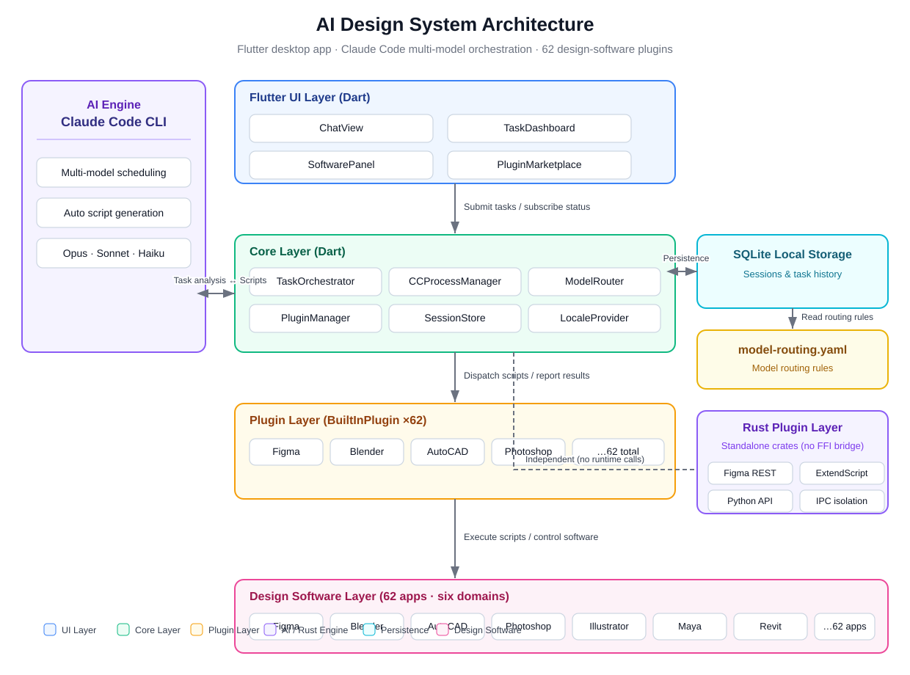
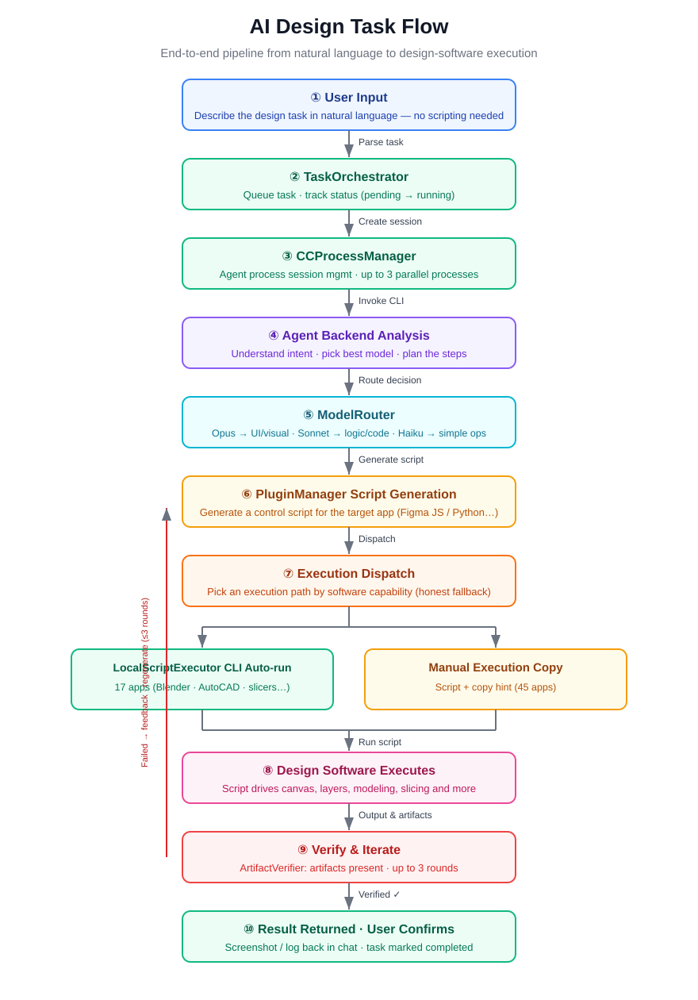
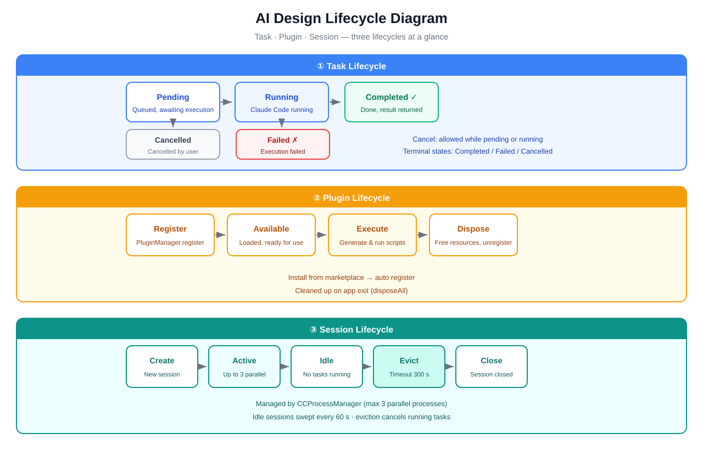
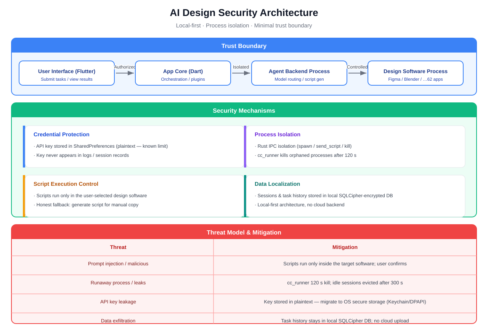
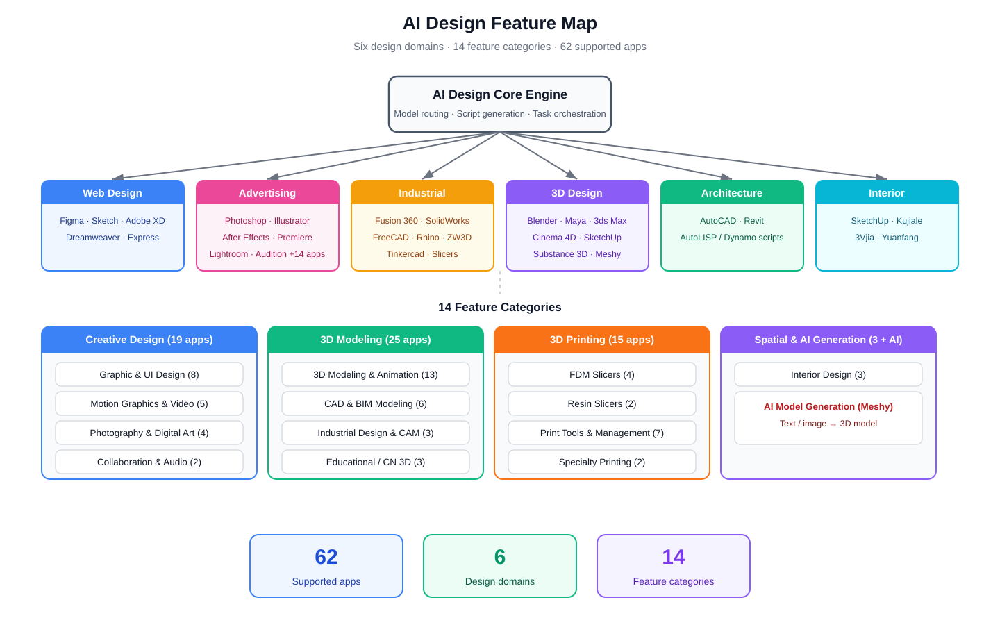

# AI Design

> Cross-platform AI-powered design automation — Claude Code integration with multi-model orchestration for controlling design software

[中文](README.md)

## Overview

AI Design is a **Windows** and **macOS** desktop application that wraps Claude Code CLI to enable AI-driven multi-model orchestration. It automatically generates and executes control scripts for various design software across **six design domains**: Web, Advertising, Industrial, 3D, Architecture, and Interior Design.

### Core Idea

Designers shouldn't need to learn every software's scripting language. Describe what you want in natural language, and AI generates and executes the control scripts to automate repetitive design tasks.

```
User: "Change all blue rectangles on the canvas to red"
  ↓
Claude Code analyzes task → selects optimal model → generates Figma JS script
  ↓
Execution layer (LocalScriptExecutor / CLI) → software executes → returns result
  (Software without CLI: script generated with manual-execution hint)
```

## Architecture

### System Architecture



### Tech Stack

| Layer | Technology | Purpose |
|-------|-----------|---------|
| UI | Flutter 3.x + Material 3 | Cross-platform desktop UI |
| Core Logic | Dart | Task orchestration, model routing, session management |
| Plugins | Dart (built-in) | Design software script generation, plugin management, marketplace |
| Config | YAML | Model routing rule configuration |
| AI Engine | Claude Code CLI | Multi-model orchestration and script generation |
| Storage | SQLite (sqflite) | Session and task history persistence |

### Task Flow



### Plugin Architecture

Each design software is a built-in `BuiltInPlugin` instance implementing the unified `DesignPlugin` interface. Generated scripts are dispatched by the execution layer:

```
Dart (interface)  →  PluginManager  →  BuiltInPlugin (script generation)
                                                    |
                          +-------------------------+--------------------------+
                          v                         v                          v
                 LocalScriptExecutor          CLI direct execution       manual-execution hint
                 (Blender/FreeCAD/           (3 headless plugins)        (software without CLI:
                  OpenSCAD script runs)                                   generate script to copy)
```

- CLI direct execution (Blender, FreeCAD, OpenSCAD): `LocalScriptExecutor` auto-detects the executable and runs the script directly; the software panel shows an Auto badge with live connection status.
- Manual execution (Figma, Photoshop, slicers, and 56 more — 59 plugins total): honest fallback — script generated with a manual-execution hint; the software panel shows a Manual badge. Slicer CLIs only accept model files rather than scripts, so they are not listed for automatic execution.

### Model Routing

| Task Type | Model | Example |
|-----------|-------|---------|
| UI/Visual Design | Claude Opus | Figma layout, color schemes |
| Logic/Code Generation | Claude Sonnet | HTML/CSS, plugin scripts |
| 3D/Spatial Reasoning | Visual model | Blender modeling, CAD |
| Simple Operations | Claude Haiku | Batch rename, export |
| Creative Brainstorming | Creative model | Ad copy, style suggestions |

Routing rules are configured in `config/model-routing.yaml` (including the `keywords` section for complexity inference). Any OpenAI-compatible API model can be plugged in.

### Lifecycle

Task, plugin, and session lifecycles at a glance. Sessions idle for more than 300 s are reclaimed by a 60-second periodic sweep, which also cancels their associated Claude processes to prevent process leaks:



### Security Architecture

Local-first · Process isolation · Minimal trust boundary:



Known limitation: the API key is stored in plaintext in local SharedPreferences. Migrating to OS-backed secure storage (macOS Keychain / Windows DPAPI) is recommended.

## Project Structure

```
ai-desgin/
+-- lib/
|   +-- main.dart                          # App entry point
|   +-- app.dart                           # MaterialApp + routing
|   +-- models/                            # Data models
|   +-- plugin_sdk/                        # Plugin interface
|   +-- core/                              # Core managers
|   |   +-- plugin_manager.dart            # Plugin registry
|   |   +-- model_router.dart              # Model routing engine
|   |   +-- cc_process_manager.dart        # Claude Code session mgmt
|   |   +-- cc_runner.dart                 # Claude Code subprocess
|   |   +-- task_orchestrator.dart         # Task orchestration
|   |   +-- session_store.dart             # SQLite persistence
|   |   +-- builtin_plugins.dart             # Built-in plugin registry (single source of truth)
|   +-- ui/                                # UI pages
+-- rust/
|   +-- core/                              # Shared traits + types
|   +-- plugins/                           # 62 software plugins
|       +-- figma/                         # Figma (REST API)
|       +-- photoshop/                     # Photoshop (ExtendScript)
|       +-- illustrator/                   # Illustrator (ExtendScript)
|       +-- indesign/                      # InDesign (ExtendScript)
|       +-- aftereffects/                  # After Effects (ExtendScript) [stub]
|       +-- premierepro/                   # Premiere Pro (ExtendScript) [stub]
|       +-- xd/                            # Adobe XD (ExtendScript) [stub]
|       +-- lightroom/                     # Lightroom (Lua) [stub]
|       +-- animate/                       # Animate (JSFL) [stub]
|       +-- audition/                      # Audition (ExtendScript) [stub]
|       +-- dreamweaver/                   # Dreamweaver (ExtendScript) [stub]
|       +-- characteranimator/             # Character Animator (ExtendScript) [stub]
|       +-- fresco/                        # Fresco (JS) [stub]
|       +-- dimension/                     # Dimension (ExtendScript) [stub]
|       +-- bridge/                        # Bridge (ExtendScript) [stub]
|       +-- acrobat/                       # Acrobat Pro (JS) [stub]
|       +-- substancepainter/              # Substance 3D Painter (Python) [stub]
|       +-- substancedesigner/             # Substance 3D Designer (Python) [stub]
|       +-- substancesampler/              # Substance 3D Sampler (Python) [stub]
|       +-- substancestager/               # Substance 3D Stager (Python) [stub]
|       +-- substancemodeler/              # Substance 3D Modeler (Python) [stub]
|       +-- mediaencoder/                  # Media Encoder (ExtendScript) [stub]
|       +-- incopy/                        # InCopy (ExtendScript) [stub]
|       +-- express/                       # Adobe Express (REST) [stub]
|       +-- sketch/                        # Sketch (sketchtool/JS)
|       +-- blender/                       # Blender (Python)
|       +-- maya/                          # Maya (Python)
|       +-- 3dsmax/                        # 3ds Max (MaxScript/Python)
|       +-- cinema4d/                      # Cinema 4D (Python)
|       +-- fusion360/                     # Fusion 360 (Python)
|       +-- solidworks/                    # SolidWorks (VBA/COM)
|       +-- freecad/                       # FreeCAD (Python)
|       +-- openscad/                      # OpenSCAD (SCAD)
|       +-- rhino/                         # Rhino (Python)
|       +-- zw3d/                          # ZW3D (Python)
|       +-- autocad/                       # AutoCAD (AutoLISP)
|       +-- revit/                         # Revit (Dynamo/.NET)
|       +-- sketchup/                      # SketchUp (Ruby)
|       +-- tinkercad/                     # Tinkercad (REST)
|       +-- meshy/                         # Meshy (AI REST)
|       +-- 3done/                         # 3D One (Python)
|       +-- voxeldance/                    # VoxelDance Additive
|       +-- happy3d/                       # Happy3D (Python)
|       +-- maodou3d/                      # Maodou 3D (Python)
|       +-- cura/                          # Cura (CLI, model files only — script runs manually)
|       +-- prusaslicer/                   # PrusaSlicer (CLI, model files only — script runs manually)
|       +-- orcaslicer/                    # OrcaSlicer (CLI, model files only — script runs manually)
|       +-- simplify3d/                    # Simplify3D (CLI, model files only — script runs manually)
|       +-- chitubox/                      # ChiTuBox (CLI, model files only — script runs manually)
|       +-- lychee/                        # Lychee (CLI, model files only — script runs manually)
|       +-- makerlab/                      # MakerLab (Python)
|       +-- crealitycloud/                 # Creality Cloud (Python)
|       +-- flashprint/                    # FlashPrint (Python)
|       +-- flashstudio/                   # Flash Studio (Python)
|       +-- snapmakerluban/                # Snapmaker Luban (Python)
|       +-- snapmakerorca/                 # Snapmaker Orca (Python)
|       +-- buildplanner/                  # Build Planner (Python)
|       +-- flashdental/                   # FlashDental (Python)
|       +-- waxjetprint/                   # WaxJetPrint (Python)
+-- config/model-routing.yaml
+-- scripts/                               # Build + release scripts
+-- test/                                  # Dart tests (107 tests)
+-- docs/
    +-- diagrams/                          # EN/ZH SVG diagrams (architecture/flow/features/lifecycle/security)
    |   +-- architecture-zh.svg            # 系统架构图
    |   +-- architecture-en.svg            # System architecture
    |   +-- task-flow-zh.svg               # 任务流程图
    |   +-- task-flow-en.svg               # Task flow
    |   +-- features-zh.svg                # 功能全景图
    |   +-- features-en.svg                # Feature map
    |   +-- lifecycle-zh.svg               # 生命周期图
    |   +-- lifecycle-en.svg               # Lifecycle diagram
    |   +-- security-zh.svg                # 安全架构图
    |   +-- security-en.svg                # Security architecture
    +-- test-report-2026-07-31.md          # Test report
    +-- review-report-2026-07-31.md        # Code review
    +-- review-report-2026-07-31-v2.md     # Code review v2
    +-- superpowers/                       # Design specs + plans
```

## Quick Start

### Prerequisites

- **Flutter SDK** >= 3.x (with Windows/macOS build support)
- **Rust** >= 1.75 (Cargo + rustup)
- **Claude Code CLI** (optional, for AI script generation)
- At least one design software: Figma / Blender / AutoCAD / Photoshop

### Setup

```bash
# Clone
git clone <repo-url> ai-desgin && cd ai-desgin

# Install dependencies
flutter pub get
cd rust && cargo build --release && cd ..

# Build (also compiles the Rust FFI core into the bundle)
bash scripts/build.sh            # macOS / Linux
scripts\build_windows.bat         # Windows

# Dev mode
flutter run -d windows            # or -d macos / -d linux
```

### Install Release Builds

Download the package for your platform from
[Releases](https://github.com/erikwang2013/ai-desgin/releases). **No Flutter /
Rust environment needed.**

**Runtime requirements**

- Windows 10 / 11 (64-bit)
- macOS 11+ (Intel / Apple Silicon)
- Linux x86_64 with the GTK3 runtime (Ubuntu 20.04+ / Debian 11+ / Fedora 38+ etc.)
- RAM ≥ 4GB, disk ≥ 300MB
- At least one target design app (Figma / Blender / Photoshop, etc.)

**Linux**

| Format | Install |
|--------|---------|
| `.deb` | `sudo apt install ./Ai Desgin-<version>.deb` |
| `.rpm` | `sudo dnf install Ai Desgin-<version>.rpm` (or `sudo rpm -i`) |
| `.AppImage` | `chmod +x Ai Desgin-<version>.AppImage && ./Ai Desgin-<version>.AppImage` |
| `.tar.gz` / `.tar.xz` | extract and run `Ai Desgin/ai_design_studio` |

**Windows**: unzip the `.zip`, run `Ai Desgin\ai_design_studio.exe`.

**macOS**: unzip the `.zip`, drag `Ai Desgin.app` to Applications.
If Gatekeeper blocks first launch: right-click → Open → Open.

### Rust Kernel Integration

At startup the app loads the Rust kernel via flutter_rust_bridge
(`libai_design_core.so` / `.dll` / `.dylib`). The plugin registry is served
from **Rust as the runtime authority** (62 plugin metadata entries + capabilities).
If the dynamic library is missing or fails to load, the app falls back to the
Dart built-in constants (`builtin_plugins.dart`) with full functionality;
the Software Panel shows "Rust kernel connected / disconnected (Dart fallback)".

Regenerate bindings after editing `rust/core/src/api.rs`:

```bash
flutter_rust_bridge_codegen generate
```

### Continuous Integration (GitHub Actions)

`.github/workflows/build.yml`: on push to `main` or a `v*` tag (or manual
trigger), builds the Rust core + Flutter app in parallel on ubuntu / windows /
macos runners and packages them automatically:

| Platform | Artifact |
|----------|----------|
| Linux | `Ai Desgin-<version>.tar.gz` / `.tar.xz` / `.deb` / `.rpm` / `.AppImage` (all include `libai_design_core.so`) |
| Windows | `Ai Desgin-<version>.zip` (includes `ai_design_core.dll`) |
| macOS | `Ai Desgin-<version>.zip` (.app embeds `libai_design_core.dylib` + ad-hoc signed) |

Artifacts are downloadable from the Actions page. Flutter is pinned to 3.44.2
(matches local Dart 3.12.2). Note: the first Windows / macOS builds may surface
platform differences not verifiable on Linux (39 plugin crates); the three jobs
are independent (`fail-fast: false`), so one platform failing does not block
the others.

### Tests

```bash
flutter test                      # All Dart tests
cd rust && cargo build            # Rust compilation (40 crates)
cd rust && cargo clippy           # Rust lint check
```

### Code Quality

| Check | Status |
|-------|--------|
| `flutter analyze` | No issues found |
| `flutter test` | 107 tests passed |
| `cargo build` | 40 crates compiled |
| `cargo clippy` | 0 warnings |

Detailed reports: [Review v26](docs/review-report-2026-08-07-v26.md) | [Review v25](docs/review-report-2026-08-07-v25.md) | [Review v24](docs/review-report-2026-08-07-v24.md)

## Usage

### 1. Connect Software

Open the app and check installed plugins in the Software Panel. Green indicator = connected, gray = not connected. Make sure your design software is running.

### 2. Select Domain

Choose a design domain from the sidebar. The AI will automatically select the optimal model and strategy:
- **Web** -> Figma, Sketch, Adobe XD, Dreamweaver, Express
- **Advertising** -> Photoshop, Illustrator, InDesign, After Effects, Premiere Pro, Lightroom, Animate, Audition, Character Animator, Fresco, Bridge, Acrobat Pro, Media Encoder, InCopy
- **Industrial** -> Fusion 360, SolidWorks, FreeCAD, OpenSCAD, Rhino, Tinkercad, ZW3D, slicers
- **3D** -> Blender, Maya, 3ds Max, Cinema 4D, 3D One, Happy3D, Maodou 3D, Meshy, Dimension, Substance 3D Suite
- **Architecture** -> AutoCAD, Revit
- **Interior** -> SketchUp, Kujiale, 3Vjia, Yuanfang

### 3. Describe Your Task

Type design instructions in natural language:

> "Create a 1440x900 login page in Figma with a centered white card, email input, password field, and blue login button"

> "Set up a room scene in Blender with a floor material and a point light"

> "Change all text layers in the current Photoshop document to use Source Han Sans"

> "Create a logo reveal animation in After Effects with 2-second scale and fade-in, ease curve"

> "Create a rusted metal material for this model in Substance 3D Painter, export 4K PBR textures"

### 4. Preview & Execute

AI generates a script preview before execution. Review it, then confirm to run. Results appear inline in the chat.

### 5. Manage Tasks

Track all tasks in the Task Dashboard: pending / running / completed / failed. Filter by status and browse history.

### Configure Models

Set up API endpoints and keys in Settings -> Model Configuration. Customize routing rules in `config/model-routing.yaml`.

### Install Plugins

Browse available plugins in Settings -> Plugin Marketplace. One-click install. New software entries appear in the Software Panel immediately.

## Features



### Graphic & UI Design

Automate Figma, Sketch, Photoshop, Illustrator, InDesign, Adobe XD and Dreamweaver operations. AI can create canvases, add layers, apply styles, export assets, and convert designs directly to HTML/CSS code.

### Motion Graphics & Video

Automate After Effects, Premiere Pro, Animate, Character Animator, Audition and Media Encoder operations. AI can create compositions, set keyframe animations, apply effects, edit video timelines, mix audio, and batch render outputs.

### Digital Painting & Photography

Automate Lightroom, Fresco, Bridge and Acrobat Pro operations. AI can batch color-grade, apply presets, manage assets, process PDF documents, and perform photo color correction.

### 3D Modeling & Animation

Covering parametric, polygonal, and NURBS surface modeling. Supports Maya, 3ds Max, and Cinema 4D for rigging, animation, and rendering. Now includes the full Substance 3D suite (Painter, Designer, Sampler, Stager, Modeler) and Dimension for PBR material authoring, 3D texturing, VR modeling, and product rendering. AI can auto-create parts, assemblies, generate technical drawings, and export STL/STEP formats for 3D printing.

### 3D Print Slicing & Management

Full support for FDM and resin printing workflows across major slicers and print management platforms. AI automatically configures layer height, infill density, and support structures based on model complexity. Supports Snapmaker multi-function CAM, Creality Cloud remote printing, and FlashDental dental printing workflows.

### AI Model Generation

Text-to-3D and image-to-3D generation via Meshy API, with automatic polygon optimization, texture generation, and multi-format export.

## Supported Software

### Graphic & UI Design (8)

| Software | Control Method | Platform | Status |
|----------|---------------|----------|--------|
| Figma | REST API | Web/macOS/Win | Supported |
| Photoshop | ExtendScript + COM/AppleScript | macOS/Win | Supported |
| Sketch | sketchtool CLI + osascript | macOS | Supported |
| Illustrator | ExtendScript | macOS/Win | Supported |
| InDesign | ExtendScript | macOS/Win | Supported |
| Adobe XD | ExtendScript + Plugin API | macOS/Win | Supported |
| Dreamweaver | ExtendScript | macOS/Win | Supported |
| Adobe Express | REST API | Web | Supported |

### Motion Graphics & Video (5)

| Software | Control Method | Platform | Status |
|----------|---------------|----------|--------|
| After Effects | ExtendScript | macOS/Win | Supported |
| Premiere Pro | ExtendScript | macOS/Win | Supported |
| Animate | ExtendScript + JSFL | macOS/Win | Supported |
| Character Animator | ExtendScript | macOS/Win | Supported |
| Media Encoder | ExtendScript + CLI | macOS/Win | Supported |

### Photography & Digital Art (4)

| Software | Control Method | Platform | Status |
|----------|---------------|----------|--------|
| Lightroom | Lua SDK | macOS/Win/iOS | Supported |
| Fresco | JavaScript API | Win/iOS | Supported |
| Bridge | ExtendScript | macOS/Win | Supported |
| Acrobat Pro | JavaScript API | macOS/Win | Supported |

### Collaboration & Audio (2)

| Software | Control Method | Platform | Status |
|----------|---------------|----------|--------|
| Audition | ExtendScript | macOS/Win | Supported |
| InCopy | ExtendScript | macOS/Win | Supported |

### 3D Animation & Modeling (13)

| Software | Control Method | Platform | Status |
|----------|---------------|----------|--------|
| Blender | Python bpy | macOS/Win/Linux | Supported |
| Maya | Python API | macOS/Win/Linux | Supported |
| 3ds Max | MaxScript / Python | Win | Supported |
| Cinema 4D | Python API | macOS/Win | Supported |
| SketchUp | Ruby API | macOS/Win | Supported |
| Rhino | Python/RhinoScript | macOS/Win | Supported |
| Meshy | REST API (AI Generation) | Web | Supported |
| Dimension | ExtendScript | macOS/Win | Supported |
| Substance 3D Painter | Python API | macOS/Win/Linux | Supported |
| Substance 3D Designer | Python API | macOS/Win/Linux | Supported |
| Substance 3D Sampler | Python API | macOS/Win | Supported |
| Substance 3D Stager | Python API | macOS/Win | Supported |
| Substance 3D Modeler | Python API | Win | Supported |

### CAD & BIM Modeling (6)

| Software | Control Method | Platform | Status |
|----------|---------------|----------|--------|
| Fusion 360 | Python API | macOS/Win | Supported |
| SolidWorks | VBA/COM | Win | Supported |
| FreeCAD | Python API | macOS/Win/Linux | Supported |
| OpenSCAD | SCAD Script | macOS/Win/Linux | Supported |
| AutoCAD | AutoLISP | macOS/Win | Supported |
| Revit | Dynamo / .NET API | Win | Supported |

### Industrial Design & CAM (3)

| Software | Control Method | Platform | Status |
|----------|---------------|----------|--------|
| ZW3D | Python API | Win | Supported |
| VoxelDance Additive | Python API | Win | Supported |
| Tinkercad | REST API | Web | Supported |

### Educational / Chinese 3D Software (3)

| Software | Control Method | Platform | Status |
|----------|---------------|----------|--------|
| 3D One | Python API | Win | Supported |
| Happy3D | Python API | Win | Supported |
| Maodou 3D | Python API | Win | Supported |

### FDM Slicers (4)

| Software | Control Method | Platform | Status |
|----------|---------------|----------|--------|
| UltiMaker Cura | CuraEngine CLI | macOS/Win/Linux | Supported |
| PrusaSlicer | CLI | macOS/Win/Linux | Supported |
| OrcaSlicer | CLI | macOS/Win/Linux | Supported |
| Simplify3D | CLI | macOS/Win | Supported |

### Resin Slicers (2)

| Software | Control Method | Platform | Status |
|----------|---------------|----------|--------|
| ChiTuBox | CLI | macOS/Win | Supported |
| Lychee Slicer | CLI | macOS/Win/Linux | Supported |

### 3D Print Management (7)

| Software | Control Method | Platform | Status |
|----------|---------------|----------|--------|
| MakerLab | Python API | Web | Supported |
| Creality Cloud | Python API | Web | Supported |
| FlashPrint | Python API | macOS/Win | Supported |
| Flash Studio | Python API | macOS/Win | Supported |
| Snapmaker Luban | Python API | macOS/Win | Supported |
| Snapmaker Orca | Python API | macOS/Win | Supported |
| Build Planner | Python API | Win | Supported |

### Specialty Printing (2)

| Software | Control Method | Platform | Status |
|----------|---------------|----------|--------|
| FlashDental | Python API | Win | Supported |
| WaxJetPrint | Python API | Win | Supported |

### Interior Design (3)

| Software | Control Method | Platform | Status |
|----------|---------------|----------|--------|
| Kujiale | JavaScript API | Web | Supported |
| 3Vjia | Python API | Web | Supported |
| Yuanfang | Python API | Win | Supported |

**Total: 62 supported software**

## Developer Guide

### Adding a New Plugin

1. Add a new `BuiltInPlugin` entry in `lib/core/builtin_plugins.dart`
2. Set `capabilities` (action list and file formats)
3. Add corresponding entries in `softwareIcons` and `softwareDescriptions` maps
4. The plugin auto-appears in `SoftwarePanel` and `PluginMarketplace`

See design docs: [Design Spec](docs/superpowers/specs/2026-07-30-ai-design-studio-design.md) | [Implementation Plan](docs/superpowers/plans/2026-07-30-ai-design-studio-plan.md)

### Configuration

**Model Routing** (`config/model-routing.yaml`):

```yaml
default: claude-sonnet-4-6
routes:
  - domains: [web, ad]
    complexity: creative
    model: claude-opus-4-7
  - domains: [industrial, threeD, arch, interior]
    model: claude-opus-4-7
  - complexity: simple
    model: claude-haiku-4-5
```

**Environment Variables**:

| Variable | Description |
|----------|-------------|
| `FIGMA_ACCESS_TOKEN` | Figma Personal Access Token |
| `MESHY_API_KEY` | Meshy AI 3D generation API key |
| `TINKERCAD_ACCESS_TOKEN` | Tinkercad API access token |

## Support

If this project helps you, feel free to support the developer ☕

<p align="center">
  <table align="center">
    <tr>
      <td align="center" width="200">
        <br>
        <b>Alipay</b>
      </td>
      <td align="center" width="200">
        <br>
        <b>Wechat Pay</b>
      </td>
    </tr>
  </table>
</p>

## License

MIT
